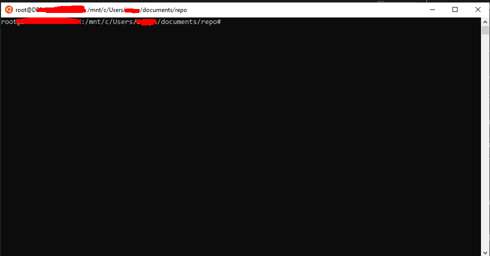

# Matching
We have two set X and Y, each with n element. A match is a pair of element from X and Y. 

```math
M = \{(x,y) : x \in X , y \in Y \}.
```
M is a matching. If |M| = n, we say the matching is perfect. 

# Stable Match
If the pairs are fairly satisfied with their pairing.It is called an stable matching. 

## Ralistic Example, Stable 
Imagine there is a dance party and we have the following men and women in the club. 

men= {Toke , Orm }

Women = {Ylva , Ingrid}

These individs have different preferences. 

Orm : Ylva , Ingrid 

Toke : Ylva , Ingrid 

Ylva : Orm , Toke 

Ingrid: Toke , Orm

Orm likes prefers to dance with Ylva and if it is not possible , he can danse with ingrid. The question is , what is an stable match in this case. It doesn't mean every body is happy but rather there is nobody who wants to chage their partner and build a new pair. 

### An example of non stable match is: 

{(Orm , Ingrid) , (Toke , Ylva)}

Because Orm and Ylva both are their eachothers first choice , they will break the current mathing and build a new pair. This pairing is perfect , because every one is included, but it is not stable. 


### An example of Stable matching is: 

{(Orm , Ylva) , (Toke , Ingrid)}


## Dave Shapleys Algorithm
Dave Shapleys Algorithm finds a stable matching 

Lets go through the algorithm. 

1. Add all men to a list of unproposed men p 
2. while p is not empty.
3. Pick a man, m  from p and look at his preference list.
4. Pick the woman,w which he preferes the most and is not yet proposed to. 
5. If the woman he picked is not proposed to and is free , they will become a pair. 
6. Else if she prefes this m over her current partner, then she will build a new pair with the man (m,w) and the old pair (mw, w) is removed. and Add mw to p.
7. is non of the condition above are satisfied, add m to p. 


## Example of Dave Shapely algorithm

Each person if give a number. 

Men: <br />
1. Orm
2. Toke

Women: 
1. Ylva 
2. Ingrid

Preference Lists

Orm:  1,2 <br />
Toke: 1,2

Ylva:   1,2 <br />
Ingrid: 2,1

The first rule is that it is the men who are proposing. So we need a list of men who haven't proposed yet. 

P = [1,2]

Things we need: 
* Each men have a list of preferences , in other words, list of womens he wants to ask for dance. 
* Each woman have a list of preferences. 
* Each men shoule know in which index he is standing . For example Toke shoule know the he has the index 2. 
* Womens preference list must be in inverted order. 

### Why inverted order for women ?

To understand why inverted order for women is needed let's analyze time komplexity. 

1. To pick a man from the p list (the list of the men who havent proposed yet.) is O(1)
2. To to through the mans preferences will take O(n)
3. If a man want to know where in the preference list of the woman he proposing to he is, he needs to go through the (in ordered) womens preferences which will take O(n). 

If we use the inverted preferences for wormen the time komplexity for a man to know where in the preference list of the women he propose to he is will only be a constant. 


### Inverted order

Imagine we have a list of men: 
1. Orm
2. Toke
3. Are 
4. Krok

The Woman named Anna have the following prefenreces: 

Anna = [3,2,4,1]

In this order, the indecies means the preference and the value is the indices of man. 

In the inverted preference list, we indicies are the indices of men and the value is her preferences. 

Anna = [4,2,1,3]

This means man in the index 1 which is Orm. have the preference 4. 


In this case, if Krok  wants to know wher in the preference of Anna he is. He can simply write his own index, which is 4 in the preference list of Anna and  Anna[4] = 3 , which means He is the third prefered partner for anna. 

# Good practice: 
## Debugg using gbd. 
If you are using windows you can use mingw gbd to integrate debugger to vscode. 
## Use valgrind to check for memoryleak.
to check for memoryleak you can use valgrind tool. 


# How to run Tests. 
___
## Create test inviroment. 
I use windows 10 and to be able to run the test i first install WLS [Windows Linux Subsystem](https://ubuntu.com/desktop/wsl) open wsl: it should look like this: 


1. change the directory to your project using: 
```bash 
cd /path/to/your/project
```
You can use `ls` to see content of the current directory. 

## Create an executable file from you c code using the following command. 
``` bash
gcc -o your_programs_name.exe your_programs_name.c
``` 

## Run only 1 test: 
when you are in the directory of your project, and created and executable file from your c code. You can use the following command to check the output of your code. 

```bash 
your_programs_name.exe < path/to/test/data.in
```

In my case , my c program is called `stable_marriage.c` and i want to test `1.in` which is in `data/sample` so I write: 

```bash 
stable_marriage.exe < data/sample/1.in 
```

## Check all solution: 
For this algothim there is an available test case that you can run to check if you code manages to pass all test cases. To run these test cases you write the following command

```bash
bash check-solution.sh ./your_programs_name.exe
```
In my case: 
```bash
bash check-solution.sh ./stable_marriage.exe
```
It will print `correct!` if you program manages to run all test case and `incorrect!` if it fails one of the test cases. 

### Using time: 
You can see the time it takes to run all of the test cases by using time in the beginning. 

```
time bash check-solution.sh ./your_programs_name.exe
```

### Python VS C 
I also implemented the algorithm in python to test its run time. You can run the python code using: 

```
time bash check-solution.sh python3 match.py
```

#### Conclusion: 
Run time in c was: 

```bash
real    0m48.829s
user    0m35.523s
sys     0m2.622s
``` 

But the same algorithm in python have a runtime: 

```bash
real    1m0.784s
user    0m55.206s
sys     0m11.941s
```

