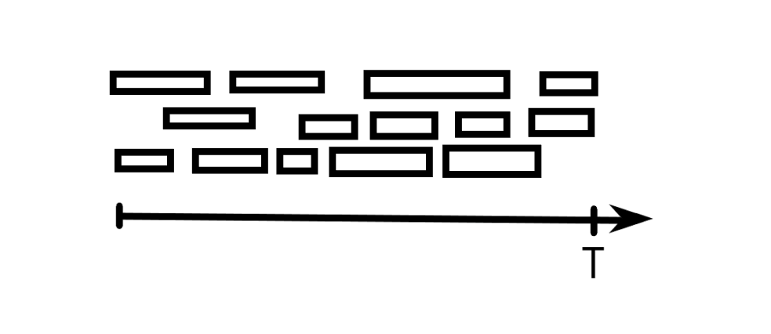
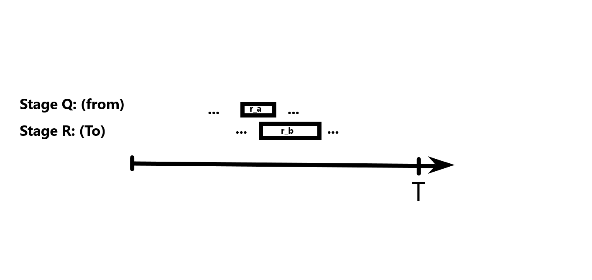

# Greedy Algorithms 

## 1. What is Greedy Algorithms? 
A greedy algorithm is an approach that makes the best possible decision at each step based on the current local information, aiming to find a globally optimal solution. It does not reconsider its choices once made, and it works well when local optimal choices lead to a global optimum.


Yes — that’s actually a great **intuition** for how greedy algorithms work, especially if you’re thinking visually or in terms of exploration.

Let’s break it down:

---

### 1.1 Game Analogy:

Imagine you're playing a game where:

* The **map starts out black**, and you can only see what’s immediately around your character.
* At each step, you must choose where to go **based only on what you can currently see**.
* Your goal is to gather the **most resources**, or reach a **goal** as efficiently as possible.
* Once you move, you **can’t go back** or undo your choices.(Have you played the )

---

### 🎯 This Fits the Greedy Algorithm Model Because:

* You **only use local information** — what’s visible or available right now.
* You **don’t know the full picture**, but you still make what seems like the best choice at each moment.
* You **don’t revisit** or adjust earlier decisions based on future information. (think of it as a miner game where you have a lanthern and can only see what is infront of you.)


### 💡 Important Caveat:

Just like in the game, greedy choices might **lead you into a dead end** or a suboptimal path — unless the game/map is structured in a way where **greedy exploration always leads to the best result**.

That’s why greedy algorithms only work well on problems where:

* **Local optimality leads to global optimality**
* The problem has the **greedy-choice property** and **optimal substructure**

---

### 1.2 What is meant by greedy-choice properties? 
With greedy properties we mean that. 
1. You can manke locally optimal choice at each step.
2. These locally optimal choices will lead to global optimum. 


### 2. **Optimal Substructure**

An optimal solution to the problem contains **optimal solutions to subproblems**.

> This also applies to dynamic programming. If the subproblems themselves can also be solved greedily, that’s a good sign.


## 2. Greedy Algorithm will not work for all problems: 
If the Greedy choice properties and optimal substructure is not fullfilled the greedy algorithm will not work. So how can we find out if the greedy algorithm is suitable for our problem. 

### Before writing a greedy algorithm:

1. **Try a few small examples by hand**:

   * Make greedy choices.
   * Check if the result is really the best possible.
   * Try a brute-force solution for comparison.
2. **Ask: If I make a greedy choice now, could it block better options later?**
3. **Prove that greedy works**, if possible:

   * Use a formal proof (exchange argument or contradiction).
   * Or try to reason informally: can you always replace any part of an optimal solution with a greedy one without making it worse?

---


## ✅ Problems Where Greedy Usually Works Well

* **Activity selection** (earliest finishing time)
* **Minimum spanning tree** (Kruskal’s, Prim’s algorithms)
* **Huffman encoding**
* **Fractional knapsack** (but **not** 0/1 knapsack!)
* **Dijkstra’s algorithm** (shortest paths with non-negative weights)
* **Job scheduling with deadlines** (under certain constraints)

---

## ❌ Problems Where Greedy Often Fails

* **0/1 knapsack problem** (greedy doesn’t consider combinations)
* **Traveling salesman problem** (greedy usually gives a poor route)
* **Coin change with non-standard denominations** 
* **Longest increasing subsequence**

---

## 🧠 Rule of Thumb

> **If your problem involves combining or selecting items based on weights, values, or priorities, and you're tempted to “pick the best one available right now,” it's worth trying greedy — but always test or prove it.**

---

## Scheduling problem 

Assume that we have a number of intervals that we need to schedule. The time scheduling problem should have the following properties. 

- Each intervall have a starting time and a finish time.

- We cannot move the intervalls rather we can either choose to take an intervall or skip it.

- The intervalls cannot overlapp. 

- All intervalls in this problem is equally important. 

- The aim is to find as many intervalls as possible.

The Question is how can we choose this intervalls.
1. Should we choose the ones that starts earliest? 
2. Should we choose the ones that ends earliest? 
3. Should we choose base on size ? 



It turns out that if we choose the ones that end earliest we have an optimal solution. 


## How can we show that a greedy algorithm is optimal?

We can show this solution is optimal by showing it is atleast as good as an optimal solution without knowing the optimal solution. 

**Proof**
Assume that out solution leads to a sequence of invervals $S = \{r_1 ,r_2, r_3 \cdots r_m \}$ and the optimal solution leads to an interval $T = \{t_1 , t_2 , t_3 \cdots t_n \}$  We want to show that $|S|=|T|$

1. Sort the optimal intervall based on end time for each intervall. in our solution, because we have chosen our intervalls based on end time we dont need to sort it. 

2. Let $s(x)$ be the start time for interval x and $f(x)$ be the end time for intervall x. 

3. we want to start by proofing the following 

$$f(r_k) \leq f(t_k)$$

this can be done by induction. 

**Base case:** The base case must be true because in our algorithm we chood the intervall with the lower end time. So $t_1$ cannot have a shorter end time that our intervall $r_1$.

$$f(r_1) \leq f(t_1)$$

**Assumption:**

$$f(r_{k-1}) \leq f(t_{k-1}) $$

because we know that the intervalls cannot overlapp we know that $f(t_{k-1}) \leq s(t_k)$ if we use transivity property of the inequality operation we can say. 

$$f(r_{k-1}) \leq f(t_{k-1}) \leq s(t_k) \implies  f(r_1)  \leq s(t_k)$$

**What does it mean?**
It means that because the stop time of $r_{k-1}$ is less that or equal to start time of the $t_k$ , this means that $t_k$ is one of the intervalls that we have not chosen yet to be included in our chosen intervalls. 

The last step of the proof is to choose the next intervall to be $t_k$. Then we will have that. 

$$f(r_k) \leq f(t_k)$$

Now let $|S| = n$ and $|T| = m$

- Now let's assume that $n < m$ Then we assume that the optimal solution have one more intervall. now we have. 

$$f(r_n) \leq f(t_n) \leq s(t_{n+1})$$

If this is the case , we see that $r_n$ end before the $t_{n+1}$ starts this means that $t_{n+1}$ is one of those intervalls that we havent included in out solution yet. so we can choose the next intervall in out sequence to be $t_{n+1}$. This contradicts the original assumption that $n<m$. Because if n is larger we can alway choose to include intervalls in S so that they are equal. therefor $m=n$.




**Annotations**
In a factory that makes soda of different kind, we have two machines, the frist machine `Q` makes the bottles and the second machine `R` pours soda in them. A bottle that not have been assembled cant be filled. So `Q` must finish its job before R can starts its `R`. 

In order for the soda to be completed it must go though both processes. 

Assume we have two different kinds of bottles. Call them r_a (task a) and r_b (task b). 

```text
time for task a = 4
time for task b = 2 
```

I will describe the process here: 

1. Machine Q starts with r_a. 
2. It finishes r_a after 4 time unit and starts with task b.

3. Machine R will start with r_a and finishes it after 4 additional time unit 4+4 = 8. 

4. Machine Q is done with r_b after 6 time unit. But it has to wait because Machine R is still busy with r_a. 


5. Machine R is done with r_a in 4 second to the total latency is 8 time unit for r_a. after 8 time unit it starts with r_b and is done with it in 2 additional time unit. the total latency for r_b is 10 time unit. look att the table below: 

### 📊 Timeline (Q → R)

| Time | Machine Q       | Machine R              |
| ---- | ------------- | -------------------- |
| 0–4  | Process `r_a` | —                    |
| 4–6  | Process `r_b` | Process `r_a` (4–8)  |
| 6–8  | —             | Process `r_b` (8–10) |


---

