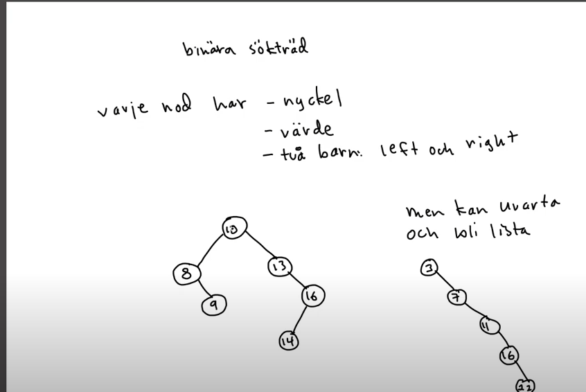
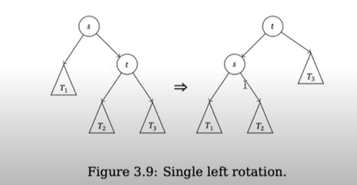
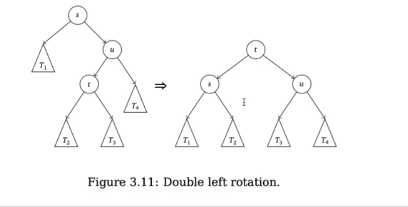
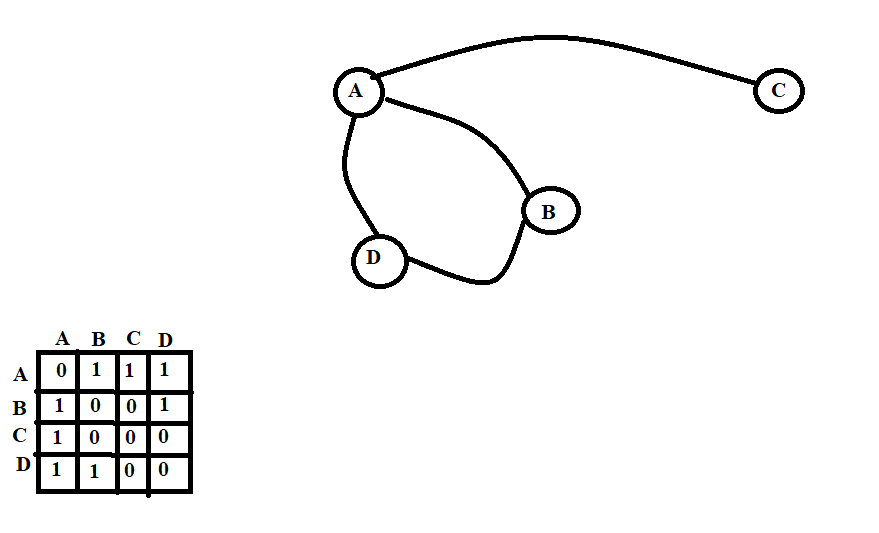
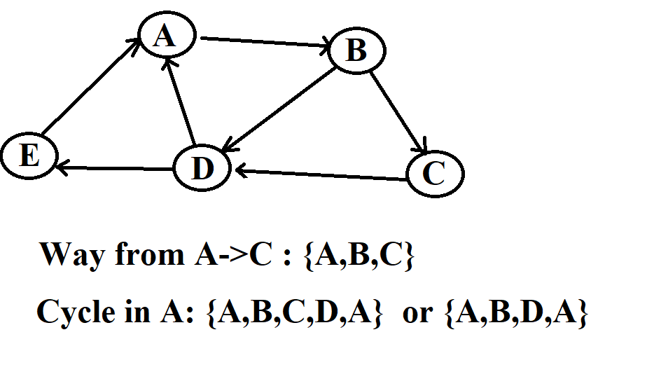
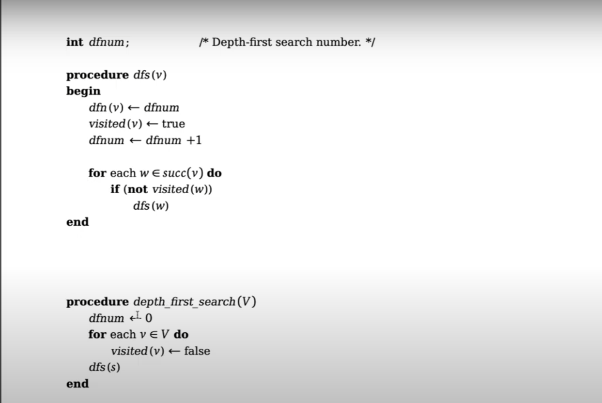
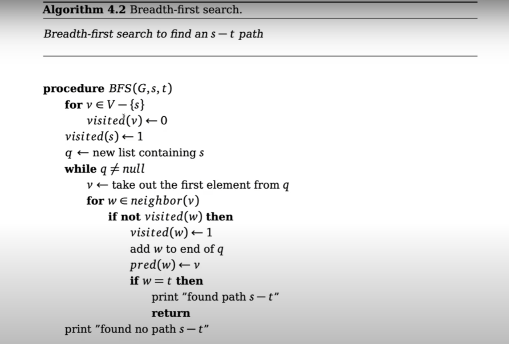

# Table Of Content 


# 1 Lists
## 1.1 Why Lists? 
The advantages of lists are flexiblity compared to Arrays. There are different variants of linked list. 

1. Simple Linked Lists (only a pointer to next node) 
2. Double Linked Lists (A pointer to next node and another to previous node)
3. Cirkular Liked Lists (A double linked list wher the last nodes next points to first node and the first nodes previouse node points to Last node)


### 1.1.1 Time Complexity Analysis Of Simply Linked List
It is the simplest form of linked list where the Node have a pointed to next. 

* **Adding an element:**
When we add an element, we need to traverse the double linked list until we read the last node and add the element at the end of the list. which means that we need to traverse over n element to reach the last. So adding an element to a linked list will have a complexity of `O(n)`.

<font color = green> **We can make simple linked list to have constant time complexity for adding an element if we can add a pointer that keeps track of last element in the array. In that way, adding an element will have constant time `O(1)`complexity** </font>

* **Removing an elemnt:** 
Removing an element from the array will have a complexity of **O(n)**

### 1.1.2 Time Complexity Analysis Of Doubly Linked List
* **Adding an element:**
When we add an element, we need to traverse the double linked list until we read the last node and add the element at the end of the list. which means that we need to traverse over n element to reach the last. So adding an element to a linked list will have a complexity of `O(n)`.

<font color = green> **Similarly, if we create a pointer that keeps track of the last node it will cost constant e.g `O(1)`time to add an element to the last node** </font>

* **Removing an elemnt:** 
If we need to search for the element that needs to be removed we need to traverse the list and it will take in worst case **O(n)** if the element is not the head.

<font color = green> **But IF we have direct access to the node, we can remove it in constant time e.g `O(1)`because it already have a pointer to the previouse respective next element let's assume that we want to remove node that are called `node_m`** </font>
we can remove `node_m`by using: 
```c
node_m.prev.next = node_m.next;
node_m.next.prev = node_m.prev;
free(node_m)
```

### 1.1.2 Time Complexity Analysis Of Cirkularly Linked List
* **Adding an element:**
When using the cirkular linked list, we already have a pointer to the last element, which is the first nodes previouse node. Because of that if will cost 'O(1)' to add an element to cirkular linked list.

* **Removing an elemnt:** 
If we need to search for the element that needs to be removed we need to traverse the list and it will take in worst case **O(n)** if the element is not the head or tail. 

<font color = green> **IF we have direct access to the node, we can remove it in constant time e.g `O(1)`.** </font>


## 1.2 Lists vs Arrays
So the milion dollar question is which one is the best, list or array? Well, there is more to that question that meets the eyes. 
### Advantages Of List: 
1. Lists are more flexible, which means that you don't need to have a predefined size for the list.

2. Disadvantages of Lists are that they takes more place (memory) and also takes more time to traverse. The reason to this have to do with chache memory and optimize compilers. 

# 2 Binary Search Trees 
Is a tree structure where each node contains the followings: 
1. Key
2. Value
3. Left child
4. Right child

The tree is build such that all nodes to the left side of the node have lower key that the node itself and all nodes to the right side of the node have a higher key that the node itself. 

The binary trees are very efficient, but when they are balanced . If they are not balanced they will look like a SLL and we waste memory on the unused childrens. Look at the example below.


The question is how we can balance a tree? We can make the tree to balance itself if we use an algorith. 

- The algorithm is called AVL 
- Called after 2 soviet matematician. Aelson-Velsky and Landin. 
- It have the ability to balance itself in every insertion and deletion . 
- Seaching in AVL tree will take a time complexity of `Ò(logn)`
- It have an additional attriute in each node: `int h = hight_left - hight_right` this additional attribut only need two bites because `h = {0,-1,1}` 
To devel deeper into AVL algotihm we need to get familiar with right and left rotation. Right rotation is when we let the right child be the root and vice versa for left rotation. 




We rotate untill the difference between right and left node is maximum 1. 

In similar way, we can have a double rotation to the left or right. 



# 3 Graphs 

A graph consist of nodes and edges. Edges will bind two nodes. A graph is written as `G(E,V)`  where E= Edges and V= nodes. A graph can be directed or undirected.

## 3.1 Graph Representation 
1. Matrix representation. We can represent a graph as a matrix. We pu a 1 if there is an edge between two node and a 0 if there is not any edge. 


* Advantages is that it is easy to find out wether two nodes are neibours. 
* Disadvantages could be that this matrix can be very large and hence cost memory to store it. 


2. List representation. 
Another representation is to have a liked list of neibours. If we need to add more nodes to the graph , it could be beneficial to use linked list.If we know that the number of neibours doesn't change, it is better to use an array. How should we allocate this array? we can use smaller arrays for each nodes neibours or a large array and allocate potions of this big array for neibours

## 3.2 Directed vs Undirected Graphs
Graphs can be directed or undirected. In directed graph, if have have an edge from A to B. It does not applie that we have an edge from B to A. In undirected gaph if we have an edge from A to B then it implies that we have and edge from B to A. 

## Path and Cycles
A Path from A to C is a sequence of node that defines a path from A to C. A cycle starts and ends in the same node. 
 

## 3.3 Traversing A graph: 
There is different ways to travers a graph. We can either search so that we reach the depth first. Or for each node we can travers all its neighbouring nodes and then travers deeper in the tree. 

### 3.3.1 Depth First Search
Deapth first search is a searching algorithm for graphs where we first explore the depth of a graph then go back to other neighbouring nodes. 

**Procedure:**
DFS(graph, start):
1. Create an empty stack S
2. Create a set to track visited nodes, visited = empty set
3. Push start node onto stack S
4. Add start node to visited set

5. While stack S is not empty:
   1. Pop node from stack S
   2. If node is not in visited:
      1. Mark node as visited
      2. For each neighbor of node in graph[node]:
         1. Push neighbor onto stack S

6. End

 

**Pseudo code:**



### 3.3.2 Bredth First Search
In stead of exploring the depth of a graph first. This algorithm can be used to find the shortest path between two nodes. So in bfs we visit all neighbours will the current node before we go to next level. 

**Prodecude**
BFS(graph, start):
1. Create an empty queue Q
2. Create a set to track visited nodes, visited = empty set
3. Enqueue start node into Q
4. Add start node to visited set

5. While Q is not empty:
   1. Dequeue a node from Q, let's call it node
   2. For each neighbor of node in graph[node]:
      1. If neighbor is not in visited:
         1. Enqueue neighbor into Q
         2. Add neighbor to visited set

6. End


**Pseudo code:**



