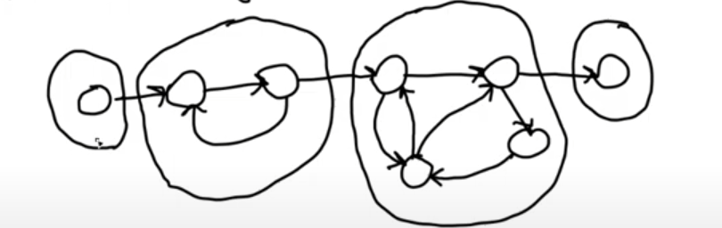
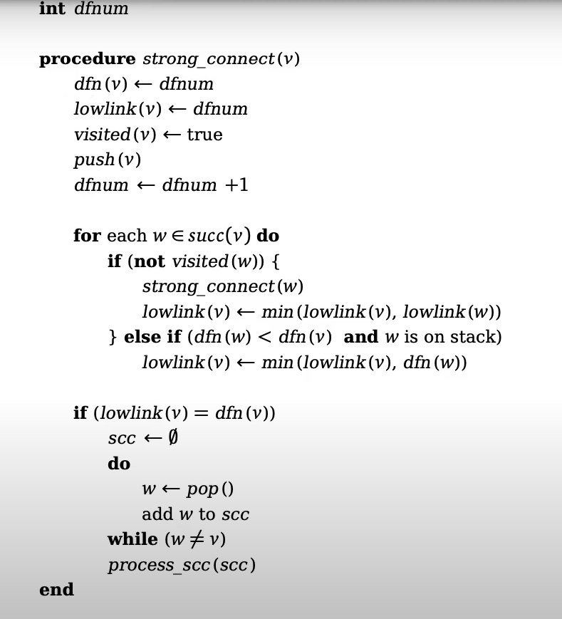
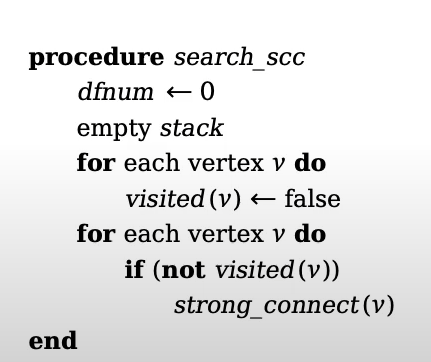

# Table Of Content


## Strongly Connected Graphs
**Deffinition**
A graph `G(V,E)` is said to be stronly connected if there for each two nodes in the graph $u, v \in V$ is a path from u to v and a path from v to u

**Theorem**
A graph is storngly connected $\leftrightarrow$ there is a path from start node any node u and from any node to s. 

proof: 

$\rightarrow$ follows from deffinition. If the graph is strongly connected. then there are path from start to any node and vice versa. 

$\leftarrow$ 
1. Assume that there is a path from start to any node and from any node to start node. 

2. then we can start in `u` and then go to start node `s` and from `s` we can go to any node `v`. 

3. To go from `v` to `u` we first go from `v` to start node `s` and then to `u`.

$u\cdots s \cdots v$ 

$v \cdots s \cdots u$


The result of this theorem is that if we pick a node S. 

1. If we succeed in showing that there is a path from S -> u  $\forall u \in V $ and there is a path from u to s then the graph is strongly connected.

## How do we determine if a graph is strongly connected? 

There are two approaches: 

**1. BFS**
```python
def Check_strongly_connected(G):
    Start in a node S 
    for each u in G:
        if bfs(s,u) == 0:
            return "there is no path from s -> u"

    G´ = reverse(G)

    for each u in G´: 
        if bfs(s,u) == 0:
            return "there is no path from u-> s"

    return "the graph is strongly connected"
```


⏱️**Time Complexity for the BFS-based Strongly Connected Check Algorithm**

Let:

* `V` = number of vertices (nodes)
* `E` = number of edges

---


1. **First BFS Traversal** on the original graph:

   * Time: **O(V + E)**

2. **Reversing the Graph**:

   * Visit each edge once to reverse it → 
   * Time: **O(V + E)**

3. **Second BFS Traversal** on the reversed graph:

   * Time: **O(V + E)**

---

### 📦 **Total Time Complexity**:

```plaintext
O(V + E) + O(V + E) + O(V + E) = O(V + E)
```

Even though we do 3 steps, they're all linear, so the total time is still **O(V + E)**.


## DFS 
This problem can be solved with DFS, the advantage of this algorithm is that is not only finds stronly connected graphs it also find the strongly connected components, meaning that the subset of the graph which are strongly connected. 

Firstly introduced by Robert Tarjan and  uses DFS and a stack. 


- Worth to note that one node itself is a strongly connected componend. 

- also a subset of the graph nodes that are strongly connected togather. 


**Required data structure**

- **Stack** 

A stack in Lifo qeue where the last element is poped first. 

- **DFS Node**

A dfs node should have following valiables. 
```c
typedef struct {
int dfn  /*depth first number */
bool visited  /* this variabl will determine if the node is visited. */
bool on_stack  /* This boolean variable determines if  whether the node is on stack or not*/
int lowlink /*lowlink number*/
}
```
### Pseudo code: 
1. define a global variable called dfnum. 
2. Start in a node called start node and run dfs, meaning that pick a neightbour of start and if it is not visited yet, add it to stack and set the visited to true. and on_stack vaiable to true.  
3. Set the low link and dfnum to the value of the global dfnum.
4. Increment the global dfnum.
5. If the successor is on stack then make the nodes lowlink the minimum of the successor and the node itself. 
6. If the nodes dfnum == lowlink then the node is the root to a strongly connected component. Then we pop the stack untill we fined the node itself in the stack. 

7. If the node is not on the stack we do not  change its lowlink. 
 




## Run the test cases: 
1. Download the repositori and cd into the directory of the files: 
2. Open ubuntu terminal and run the following command. 
3. first you have to build an executable file from you raw c code with 
```bash
gcc -g scc_dfs.c -o scc_dfs
```
then you can check solution by

```bash
bash check_solution.sh ./scc_dfs
```

4. If you want to input costum input file: 

- Your input file should  have the following format 

first line is the number of node in you graph

- second line is the neighbours of node 0 seperated by a space. OBS dont put space at the end of the line 
- Third line is the neibours of node 1 seperated by a space. 
$\vdots$
- L:th line is the neibours of node L-2 seperated by a space.

example input.txt
```c
8
1
2 8 6
3
4 7
5
6
2 3
6
6
```

graph representation is: 
first line indicated that the graph has 8 nodes: And nodes neighbours relations is as follows: 
```python
"node 0" : 1
"node 1" : 2 , 8 , 6
"node 2" : 3
"node 3" : 4 , 7
"node 4" : 5
"node 5" : 6
"node 6" : 2 , 3
"node 7" : 6
"node 8" : 6 
```
Then you can use the following command to validate your input file: 
```bash
./scc_dfs < input.txt
```
assuming the input file is renamed to `input.txt`. 