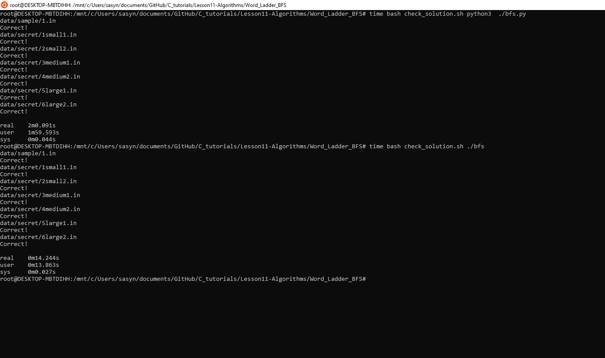

# 1. Problem formulation: 
we construct a graph where each node represents a five-letter word (the words are not necessarily in the English
dictionary, but consist only of lowercase English letters, a–z). Furthermore we draw an (directed) arc from u to v if all
of the last four letters in u are present in v (if there is more than one of a specific letter among the last four letters in
u, then at least the same number has to be present in v in order for us to draw the edge). For example there is an edge
from ”hello” to ”lolem” but not the other way around. There is both an edge from ”there” to ”where” and the other
way around. There is not an edge from ”there” to ”retch” since ”e” is only present once in ”retch”.
You will be asked to answer a series of queries. For each query you will be given two words, the ”starting”-word
and the ”ending”-word. The task is to find the length of the shortest path from the ”starting” to the ”ending” word for
each query.


# 2. Algorithm: 
In this task we are trying to implement a BSF algorithm to find the shortest path between two nodes (in our case, two words). 

## 2.1 Graph representation.


There are different ways to represent a graph. 

___

**NxN bool matrix**

The first method of representing a graph is a matrix the size of the matrix is nxn where n is the number of nodes in the graph. We then index our nodes, and place a 1 in row i and column i+1 if there is an edge from node with index i to node with index i+1. In the case of undirected graph, this matrix will be symmetric. 

The problem with matrix approach is that when the number of nodes gets large, it need large memory to store this nodes in the matrix. Also we need two nested for loop to write the values into the matrix. So the time complexity for creating the graph is O(n^2)
___

**Array List**

Another way of representing a graph is to put the nodes neigbours in an array list. This method is used if we know that the number of neibours are varying. 

___
**Fixed sized array**

Another approach is to use a usual array to store the neibouring nodes. This is used when we know that each node have fixed size neighbour. 


We represent the graph as an array where the index of array is the node number. 
Each node should have a value (which in our case it is a 5 letter word). Each node should keep track of its neighbouring nodes (for this we choose a dynamic array,  because the number of neighbours are not fixed e.g it can have 0 to n-1 neighbours so we want it to be flexible. We also could use linked list.). We store the indecies of the neighbours/edges in the dynamic array.  


### 2.1.1 How do we check if there is an edge between two word. 
Here there is two approaches: 

Here’s an improved version of your explanation with clearer structure, grammar, and wording:

---

**1. Using letter frequency**

Create an array to represent the frequency of each letter in the English alphabet (e.g., an array of size 26, where each index corresponds to a letter from 'a' to 'z').

Then, for the **last four letters** of `word1`, compute their frequency and compare it to the frequency of the letters in `word2`.

If the frequency counts of these four letters **match** their counts in `word2`, then there is an **edge from `word1` to `word2`**.
Otherwise, **no edge exists**.


```c
// Function to count frequency of characters in the last 4 characters of a word
void count_letters(const char *word, int freq[26] , int method) {
    /*
    method is a parameter 
    method = 0 , frequency of the fourd last letters
    method = 1 , frequency of all letters
    */
    if (method == 0){
        for (int i = 1; i < WORD_LENGTH; i++) {
            freq[word[ i] - 'a']++;
        }
    }
    else if (method == 1){
        for (int i = 0 ; i< WORD_LENGTH ; i++){
            freq[word[i]-'a']++;
        }
    }

}

// Function to determine if one word can reach another
int can_reach(const char *u, const char *v) {
    int u_freq[26] = {0};
    int v_freq[26] = {0};
    
    count_letters(u , u_freq , 0); // four last letters of u 
    count_letters(v , v_freq , 1); // frequency of all five letters of v

    // Check if all characters of u's last four letters are in v with equal or greater frequency
    for (int i = 0; i < 26; i++) {
        if (u_freq[i] > 0) {
            if (u_freq[i] != v_freq[i]){
                return 0;
            }
        }
    }
    return 1; // Edge from u to v exists
}
```


**2: Using linked list**

We create a linked list where each node contains the following:

* `value`: the letter itself
* `node_num`: the position of the letter in `word2`
* A pointer to the next node

Then, for each of the **last four letters** in `word1`, we loop through **all letters** in `word2`. For each match between a letter in `word1` and a letter in `word2`:

* If a node with the same letter **and** position (`node_num`) is **already in the list**, we skip it.
* If it's **not in the list**, we add it as a new node.

Finally, we count the number of nodes in the linked list.

* If there are **exactly four nodes**, it means there is an **arc from `word1` to `word2`**.
* Otherwise, there is **no arc**.

```c
int finns_i_sjon(Node **root , char * ch , int ind ){
    if (*(root) == NULL){
        *(root) = init_node(ch ,ind);
        return 0;
    }
    else{
        Node * temp = *(root); 
        while (temp != NULL){
            char comp = *(temp->value);
            if ( comp  == *ch &&temp -> node_num == ind){
                return 1;
            }
            temp = temp->next;
        }
        add(root, ind , ch );
        return 0;
    }
}

int node_from_1_to_2( char * word_1 , char * word_2){
    Node * root = NULL;
    for (int i=1 ; i< 5 ; i++){
        char ch = word_1[i];
        for (int j = 0 ; j <5 ; j++){
            if (ch == word_2[j]){
 
               if (finns_i_sjon(&root ,&(word_2[j]) , j ) == 0){
                  break;
               }
                
            }
        }

    }


```

## BFS: 


