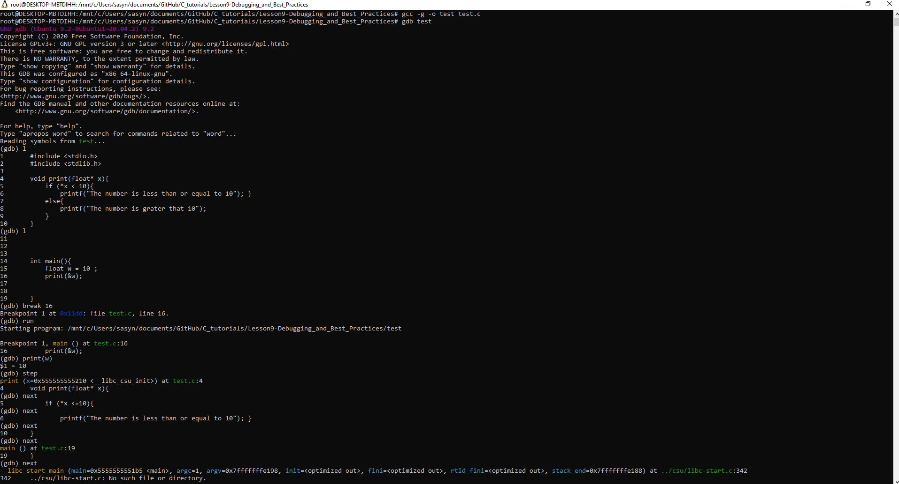
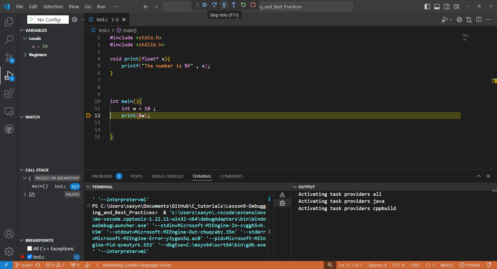
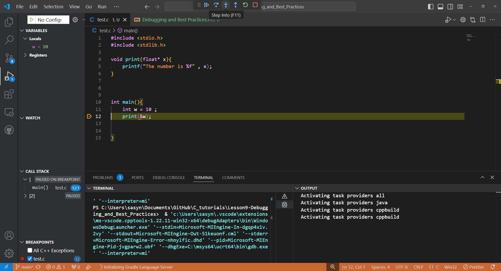

Here's a basic tutorial in C covering each of these topics.

---

# 1. Debugging Techniques and Tools (`gdb`)
If you using Linux OS u can use gdb for debugging. first make sure gcc is installed by using_ 
```c
gcc --version 
```
If the version is displayed, you dont need to install `gcc` otherwise you can install `gcc` by using: 
```c
sudo apt install gcc
```
You also need to install `gdb`. You can install `gdb` by writing following command in linux terminal: 
```c
sudo apt install gdb
```

`gdb` is a powerful debugging tool for C programs. Here’s how to get started:

1. **Compile with Debugging Info**: Use the `-g` flag to include debugging information.
   ```bash
   gcc -g -o program program.c
   ```

2. **Starting `gdb`**: Launch `gdb` with your compiled program.
   ```bash
   gdb program
   ```

3. **Setting Breakpoints**: Stop at specific lines or functions to inspect code.
   ```gdb
   (gdb) break main       # Set a breakpoint at the beginning of main
   (gdb) break 10         # Set a breakpoint at line 10
   ```

4. **Running the Program**: Use `run` to start the program in `gdb`.
   ```gdb
   (gdb) run
   ```

5. **Stepping Through Code**: Use `next` to execute the next line, or `step` to enter a function.
   ```gdb
   (gdb) next
   (gdb) step
   ```

6. **Inspecting Variables**: Use `print` to view values of variables.
   ```gdb
   (gdb) print variable_name
   ```

7. **Exiting `gdb`**: Use `quit` to exit.
   ```gdb
   (gdb) quit
   ```

## 1.1 Debugging Uning vs-code
If you are using Vscode in windows to code, it is really easy to use debug tools I demonstrate it with two images. 
1. The first step is to change the run mode to debug mode. 

2. The second step is to run debug mode and then a navigation bar appears on mid top of the editor. You can debug you by steppig into functions or stepping over. 
 


### 2. Writing Clean Code

- **Comments**: Explain the purpose of complex code segments. Use single-line comments (`//`) and block comments (`/* ... */`).

   ```c
   // This function calculates the factorial of n
   int factorial(int n) {
       if (n <= 1) return 1;
       return n * factorial(n - 1);
   }
   ```

- **Indentation**: Consistently use 4 spaces or a tab for each indentation level.

- **Meaningful Names**: Use descriptive names for variables and functions to make the code self-explanatory.
  
   ```c
   int calculateFactorial(int number) {
       if (number <= 1) return 1;
       return number * calculateFactorial(number - 1);
   }
   ```

### 3. Error Handling (`errno`)

`errno` is a global variable in C that stores error codes set by system calls and standard library functions. Here’s how to use it:

1. **Including `<errno.h>`**: This header defines `errno` and several error codes.

   ```c
   #include <errno.h>
   #include <stdio.h>
   #include <string.h> // for strerror
   ```

2. **Checking for Errors**: After calling a function that may fail (e.g., `open`, `malloc`), check `errno` to understand the error.

   ```c
   FILE *file = fopen("nonexistent.txt", "r");
   if (file == NULL) {
       printf("Error opening file: %s\n", strerror(errno));
   }
   ```

3. **Handling Errors**: Use conditionals to handle different error codes appropriately.

### 4. Profiling Code (Using Valgrind for Memory Leaks)

`Valgrind` is a tool for detecting memory leaks and profiling.

1. **Installing Valgrind**: Install with your package manager, e.g., `sudo apt-get install valgrind` on Ubuntu.

2. **Running Valgrind**: Run your program with Valgrind.
   ```bash
   valgrind --leak-check=full ./program
   ```

3. **Interpreting the Output**: Valgrind will show memory leaks, including where memory was allocated but not freed.

   Example output:
   ```
   ==12345== 8 bytes in 1 blocks are definitely lost in loss record 1 of 1
   ==12345==    at 0x4C2E6A7: malloc (vg_replace_malloc.c:307)
   ==12345==    by 0x10868F: main (example.c:10)
   ```

4. **Fixing Leaks**: Free allocated memory with `free()`.

   ```c
   int *arr = malloc(10 * sizeof(int));
   if (arr != NULL) {
       // Do something with arr
       free(arr); // Prevent memory leak
   }
   ```

### 5. Time Complexity Analysis

Time complexity analysis helps estimate the runtime of your code. Here are some basics:

1. **Counting Operations**: Identify the number of times key operations (like comparisons or additions) run with respect to input size `n`.

   - **Constant Time (`O(1)`)**: Code runs the same regardless of `n`.
   - **Linear Time (`O(n)`)**: Loops that run `n` times.
   - **Quadratic Time (`O(n^2)`)**: Nested loops, each running `n` times.

   Example:
   ```c
   for (int i = 0; i < n; i++) {
       printf("Hello\n"); // O(n) - Runs n times
   }
   ```

2. **Analyzing Algorithms**: Use Big-O notation to categorize algorithms by growth rates and compare their efficiency.

   Example:
   ```c
   int sumArray(int arr[], int size) {
       int sum = 0;
       for (int i = 0; i < size; i++) {
           sum += arr[i];
       }
       return sum; // O(n)
   }
   ```

---
